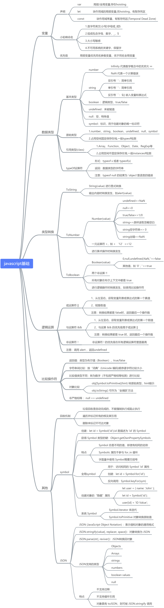
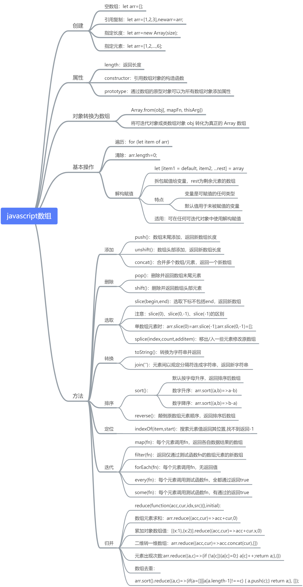
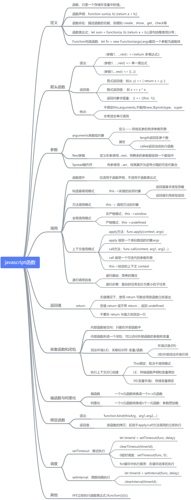
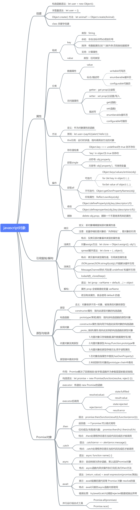
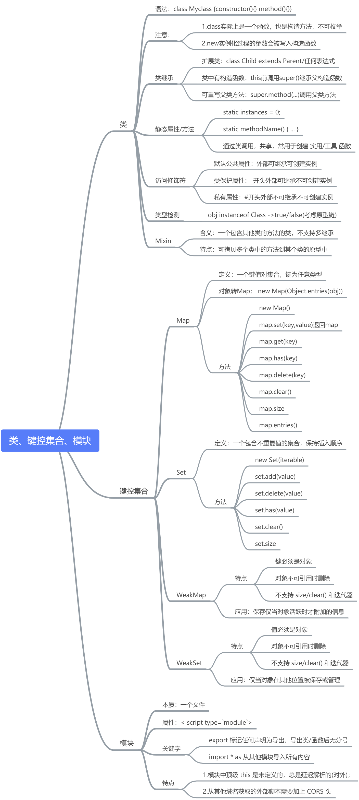
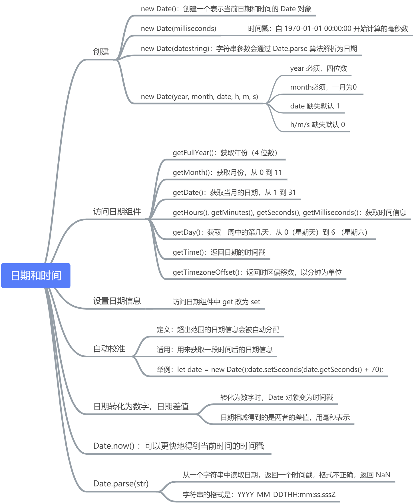

# Javascript 基础语法学习总结

前言：Javascript 作为前端的核心，主要用来操控和重新调整 DOM，通过修改 DOM 结构来达到修改页面效果的目的。这一学习过程有点类似学英语，html 是名词，css 是形容词，javascript 是动词。理论方面需要先理解记忆单词，可以通过**思维导图**来总结知识，夯实基础；实践方面则需要不停地写句子、段落及文章，可从面向对象的角度尝试做出**实用组件**。

---

## javascript 基础

---

## javascript 数组

## 

---

## javascript 函数

---

## javascript 对象

## 

## javascript 类、键控集合、模块

## 

## javascript 日期和时间

